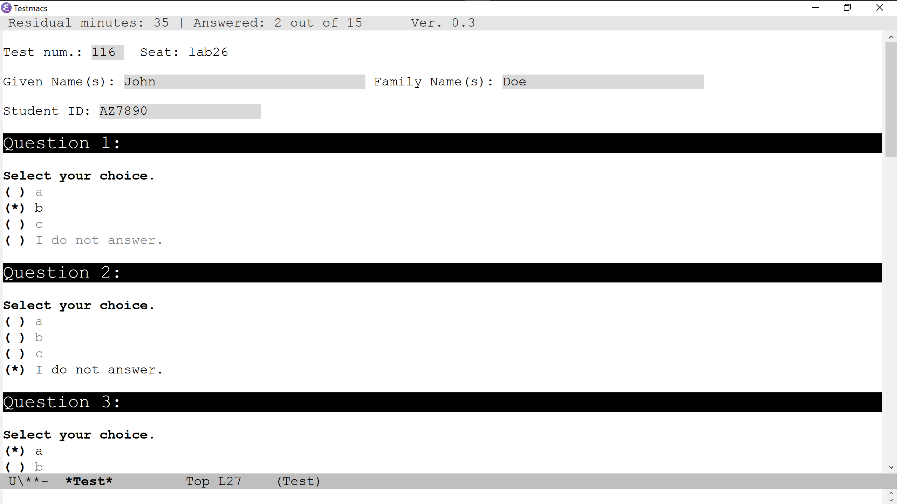
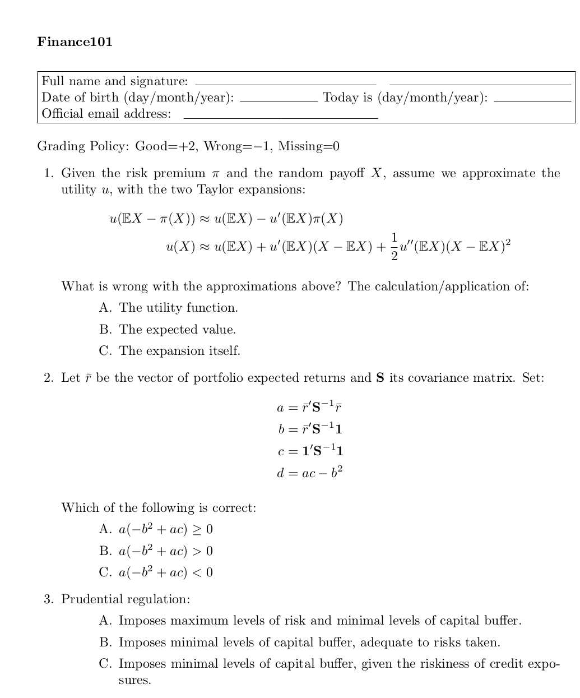
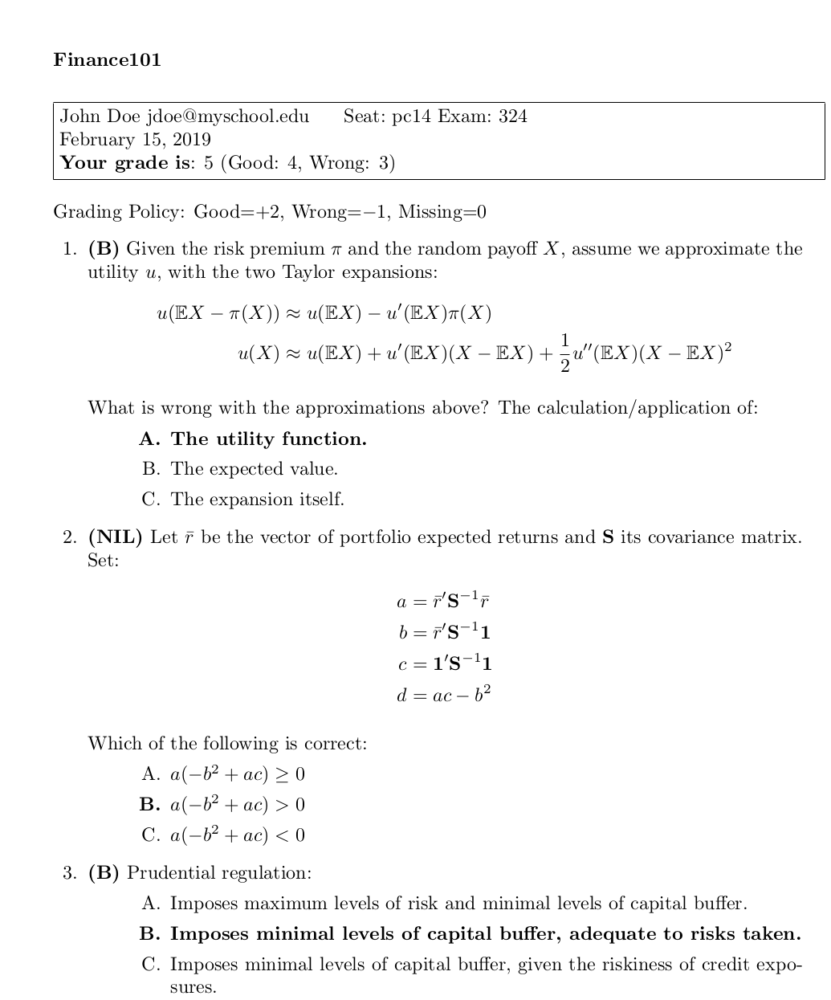

<!--

pandoc README.md -o README.html

//-->

<!-- Not supported in GitHub

//-->

# Testmacs
Administer classroom tests over a LAN 

Testmacs implements a simple multiple-choice test.

The student is given a paper-sheet with a test ID and the questions' text.   
On screen, Testmacs asks for test ID plus some  personal student details.
Questions are without question-text, e.g.: 

    Question N:
    [] a
    [] b 
    [] c 
    ... 
    [] I do not know.

The test shows a mode line with answered questions and a countdown in minutes.
At countdown expiration Testmacs exits, saving answers.
At predefined times (10 seconds) the answers are saved locally and remotely.

The paper test may be like follows:

After test, a result PDF can be automatically produced (click for equivalent PDF):

## Other Features and Customisations

Answers are stored locally in the parent of `exam-loc-server-ini` and remotely in `exam-net-course-pt`.
To find the remote share, the file retrived from `exam-loc-server-ini` is used.   
Answers collected on the remote folder as text files can be easily parsed with any program to assign grades.

### Default Entries
Before the question area, the computer screen reports some fields to collect student details. By default they are:
 
    Test num.: _______
    Given Name(s): _______________________  Family Name: _____________________________
    Student ID: ___________________
 
An equivalent answer file is produced locally and remotely (as set by the variables `exam-loc-ans-file-pt` and `exam-net-ans-file-pt`. The asnwer file will be similar to the follwing:
 
    exam-id:123
    given-name:John
    family-name:Doe
    student-id:1234567
    ans-string:"b" "b" nil nil "b" nil "a" "b" nil "a" nil nil nil nil nil
 
The values after the colon for `exam-id`, `given-name`, `family-name`, and `student-id` depend on the respective values typed by the student for Test num., Given Name(s), Family Name and Student ID. 
 
`ans-string` is clearly a list of the answer given `nil` being the answers not given.
 							       
### Custom Entries
You can customise the fields adding the file `~/custfld.txt`. Note that the Windows launcher redirects the home directory `~` to the subdirectory `data` found in Testmacs package. Each line in this file has a custom-field entry with the format `Name:Width:Text`.    
`Name` is the field name as reported in the answer files.   
`Witdh` is the width of the user typing area, but note that the initial width will dynamically expads as the user types.    
`Text` is the text describing the information to be entered, displayed on the screen to the left of the typing area.  However, if `Width` is 0, the field is only informative and there is no information to type. `Width` can be -1, in which case the nothing is displayed on screen, just the the combination `Name:Text` is reported in the answer files for further processing.

Example:

    project-date:10:Date when you delivered the class project: %v \n
    disp-seat-name:0:Computer name is %c\n
    seat-name:-1:%c
 
`project-date` is an editable field and the text `Date when you ...` will be displayed replacing `%v` with an edititable area of 10-character width. Information entered is reported in the answer files as `project-date:DATE`, where DATE is the value typed by the student. 
`disp-seat-name` displays on the subsequent line the screen text "Computer name is foo", where "foo" is the name of the computer where Testmacs is running. 
`seat-name` is similar to the preceding field, but it does not involve any screen display, only `seat-name:foo` is reported in the answer files.
To add line-breaks to `Text` use `\n` with a single slash.
 
Customs fields are displayed immediately after default fields area. If you include a default field in  `~/custfld.txt`, that field will be removed from default field area.

Read the Elisp docstring of `exam-loc-cust-fld` for more information.

### Remote Commands
Testmacs performs some actions if detects predefined command filenames in the
  remote directory `exam-net-data-pt`. See action for each command filename.
Command filename "exit007": Emacs will exit in 10 seconds.   
Command filename "update007": Emacs updates `site-start.el` with the file `new-site-start.txt`
in the remote directory `exam-net-data-pt` and possibly the file `custfld.txt` with remote `new-custfld.txt`.
If `new-site-start.txt` is not found or there is a copy error a non-critical error is displayed
until the action succeeds or the command filename is removed. Read the docstring of `remote-update` function for more information. 

## Intallation notes

To be done

